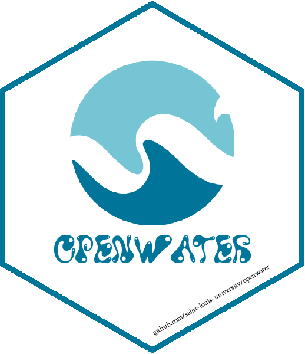

<!-- README.md is generated from README.Rmd. Please edit that file -->

```{r, include = FALSE}
knitr::opts_chunk$set(
  collapse = TRUE,
  comment = "#>",
  fig.path = "man/figures/README-",
  out.width = "100%", 
  eval = FALSE
)
```

```{r sticker, eval=FALSE, include=FALSE}
library(showtext)
font_add("Crimson Text", "C:/Windows/Fonts/CrimsonText-Regular.ttf")
font_add("Water Park", "C:/Windows/Fonts/Water Park.ttf")
showtext_auto()

ow_light_blue <- "#77c6d6"
ow_dark_blue <- "#00769a"

library(hexSticker)
sticker(subplot = "man/figures/openwater_logo.png", 
        s_x = 1, 
        s_y = 1.2, 
        s_width = 0.5, 
        s_height = 0.5, 
        package  = "openwater", 
        p_x = 1, 
        p_y = 0.6, 
        p_color = ow_dark_blue, 
        p_family = "Water Park", 
        p_size = 18, 
        h_fill = "#ffffff", 
        h_color = ow_dark_blue, 
        url = "github.com/saint-louis-university/openwater", 
        u_color = "black", 
        u_family = "Crimson Text", 
        u_size = 3.5, 
        u_x = 1.005, 
        u_y = 0.1, 
        filename = "man/figures/openwater.png")
```

# openwater 

<!-- badges: start -->
[](https://github.com/Saint-Louis-University/openwater)
[](https://github.com/Saint-Louis-University/openwater/commits/master)
<!-- badges: end -->

## Overview

The goal of `openwater` is to provide R bindings for [OpenWater](https://www.getopenwater.com/) [Application programming interface (API)](https://en.wikipedia.org/wiki/Application_programming_interface)

<br />

## Installation

You can install `openwater` from [GitHub](https://github.com/saint-louis-university/openwater) with:

```r
remotes::install_github("Saint-Louis-University/openwater")
```

<br />

## About

### Saint Louis University 
Founded in 1818, [Saint Louis University](https://www.slu.edu) is one of the nation’s oldest and most prestigious Catholic institutions. Rooted in Jesuit values and its pioneering history as the first university west of the Mississippi River, SLU offers nearly 13,000 students a rigorous, transformative education of the whole person. At the core of the University’s diverse community of scholars is SLU’s service-focused mission, which challenges and prepares students to make the world a better, more just place.
